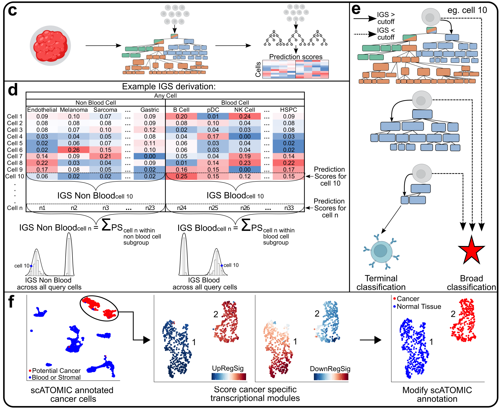
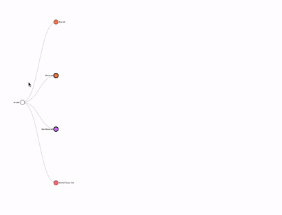

<!-- README.md is generated from README.Rmd. Please edit that file -->

```{r setup, include=FALSE}
knitr::opts_chunk$set(echo = TRUE)
```

# scATOMIC

<!-- badges: start -->
<!-- badges: end -->
**S**ingle **C**ell **A**nnotation of **T**um**O**ur **M**icroenvironments **I**n pan-**C**ancer settings




## Installation

Note: Mac users require Xcode Command Line Tools for the installation. 
To check if these are installed run the following in terminal:

```{bash}
xcode-select -p
```


Install these by running the following in terminal if CommandlLineTools are not found:

```{bash, eval=FALSE}
xcode-select --install
```


To install scATOMIC you will need to use the devtools package. We recommend you install other dependencies first.
Note: The package "cutoff" we use is a developer package that is different from the CRAN "cutoff" package.

```{r, results='hide', eval=FALSE}
if(!require(devtools)) install.packages("devtools")
if(!require(cutoff)) devtools::install_github("choisy/cutoff")
if(!require(scATOMIC)) devtools::install_github("abelson-lab/scATOMIC")


```

In scATOMIC we rely on the Rmagic package to impute values.

To use MAGIC, you will need to install both the R and Python packages.

If python or pip are not installed, you will need to install them. We recommend Miniconda3 to install Python and pip together, or otherwise you can install pip from https://pip.pypa.io/en/stable/installing/.

Installation from CRAN
In R, run this command to install MAGIC and all dependencies:

```{r,eval=FALSE}
if(!require(Rmagic)) install.packages("Rmagic")
```


In a terminal, run the following command in command line to install the Python repository:

```{bash, eval=FALSE}
pip install --user magic-impute
```

Often the python magic module is not loading properly in R and the following in R is producing FALSE:
```{r, eval=FALSE}
Rmagic::pymagic_is_available()
```

To resolve this issue run:

```{r,eval=FALSE}
library(reticulate)
library(Rmagic)
install.magic()
pymagic_is_available()
```


For more information visit https://rdrr.io/cran/Rmagic/f/README.md#installation

## Tutorial for scATOMIC
### Applications
scATOMIC is designed to classify cells within the pan cancer TME hierarchy:


We have validated scATOMIC in external datasets of bladder, brain, breast, colorectal, kidney, liver, lung, neuroblastoma, ovarian, pancreatic, prostate, sarcoma, and skin cancers. 
Additionally, one can apply scATOMIC to bile duct, bone, endometrial, esophageal, gallbladder, and gastric cancer, however, we have not validated these classes in external datasets and they may be misclassified as other related cancers. 
For a full list of subtypes included in scATOMIC's reference see Table S2 in the manuscript.


### Loading dependencies

First we load all needed packages
```{r, results='hide', message=FALSE}
library(scATOMIC)
library(plyr)
library(dplyr)
library(data.table)
library(randomForest)
library(caret)
library(parallel)
library(reticulate)
library(Rmagic)
library(Matrix)
library(Seurat)
library(agrmt)
library(cutoff)
library(copykat)
library(ggplot2)

```
### Input data

scATOMIC is run directly on gene by cell count matrices. 
We recommend running scATOMIC on sparse matrices to speed up performance and save memory. 
To convert a regular matrix or dataframe to a sparse matrix run:

```{r, eval= FALSE}
#where input_matrix is any non sparse count matrix
sparse_matrix <- as(as.matrix(input_matrix), "sparseMatrix")
```

To extract raw count sparse matrices from Seurat objects run:

```{r, eval= FALSE}
#where seurat_object is any scRNA-seq Seurat object
sparse_matrix <- seurat_object@assays$RNA@counts
```

### Load demo dataset
We included a demo dataset of a primary lung cancer sample within our package under the object name 'demo_lung_data'. 
We store this as a sparse matrix.


```{r}
lung_cancer_demo_data <- demo_lung_data
```

### Preprocessing dataset
We strongly recommend the user filter low quality cells from their dataset.
We recommend to remove any cells with more than 25% of reads mapping to mitochondrial genes or those with fewer than 500 unique features expressed. 
The user can change the pct mt and nFeatureRNA numbers to suit their own filtering parameters. 

```{r}
pct_mt <- colSums(lung_cancer_demo_data[grep("^MT-", row.names(lung_cancer_demo_data)),])/colSums(lung_cancer_demo_data) * 100
nFeatureRNA <- apply(lung_cancer_demo_data, 2,function(x){length(which(x != 0))})
lung_cancer_demo_data <- lung_cancer_demo_data[, names(which(pct_mt < 25))]
lung_cancer_demo_data <- lung_cancer_demo_data[, intersect(names(which(nFeatureRNA > 500)), colnames(lung_cancer_demo_data))]
```

### Running scATOMIC
To run scATOMIC we use the run_scATOMIC() function to generate a detailed annotation object. 
To run with default settings simply use: 
```{r,  message=FALSE,results='hide'}
cell_predictions <- run_scATOMIC(lung_cancer_demo_data)
```

Ignore warnings regarding unexpressed genes.
This returns a list object with predictions for each cell at each layer of the hierarchy. 

Other relevant parameters of run_scATOMIC whether to use imputation (default = TRUE), how many cores to use, and the threshold for classifying cells.


After running scATOMIC we generate a summary of the intermediate results with create_summary_matrix().
Here we need to input our prediction list and the raw count data.
By default we set use_CNV to FALSE to avoid CNV corrections. 
We set modify_results to TRUE to allow for the assumption that only one cancer type is in the sample. 
See ?create_summary_matrix for information on the other parameters.

create_summary_matrix() returns a matrix that provides the final classification for each cell as well as the classification at each layer

```{r, message=FALSE, warning=FALSE, results='hide'}
results_lung <- create_summary_matrix(prediction_list = cell_predictions, use_CNVs = F, modify_results = T, mc.cores = 1, raw_counts = lung_cancer_demo_data, min_prop = 0.5 )
```
```{r}
table(results_lung$scATOMIC_pred)
head(results_lung)
```


## scATOMIC CNV mode 
To calculate inferred CNV status  we offer a built in argument to run CopyKAT CNV inference.
In this mode we run the create_summary_matrix() function with use_CNVs = TRUE.
Note: CNV correction takes significantly longer than the regular mode of scATOMIC and can be sped up with parallel computing.
We recommend using parallel multi-core processing by setting the mc.cores argument to the number of cores that can be used.

```{r, eval=FALSE}
results_lung_CNV <- create_summary_matrix(prediction_list = cell_predictions, use_CNVs = T, modify_results = T, mc.cores = 6, raw_counts = lung_cancer_demo_data, min_prop = 0.5 )
```

## Visualizing Results

To visualize the results of scATOMIC we provide the scATOMICTree() function

```{r, results='hide'}
tree_results_lung <- scATOMICTree(predictions_list = cell_predictions, summary_matrix = results_lung, 
                                  interactive_mode = T, collapsed = T, save_results = F,height = 700, width = 1000)

```

This produces an interactive tree for the results. 
Click on nodes to expand and reveal subgroups.
Hover your mouse over dots to get metrics (in RStudio Viewer or can save the tree to HTML via the save_results argument)  
Github .md files do not allow the interactive html file to be embedded but it can be visualized in the R console or by opening the saved file in a web browser.
This gif demonstrates the interactive mode:



By setting the collapsed argument to FALSE we can generate an interactive tree that is fully open

```{r, results='hide'}
tree_results_lung_open <- scATOMICTree(predictions_list = cell_predictions, summary_matrix = results_lung, 
                                  interactive_mode = T, collapsed = F, save_results = F,height = 700, width = 1000)


```
Github .md files do not allow the interactive mode to be seen but can be visualized in the R console or by opening the saved file in a web browser.

By setting the interactive mode to FALSE, we can generate a non interactive tree
```{r, results='hide'}
tree_results_non_interactive <- scATOMICTree(predictions_list = cell_predictions, summary_matrix = results_lung, 
                                  interactive_mode = F, save_results = F)
```

```{r, eval=FALSE}
tree_results_non_interactive
```


## Adding Results to Seurat object

If one wants to visualize the results in a Seurat object we can easily add the annotations and visualize the results using the DimPlot() function.

First we create a seurat object with our count matrix
We can add our annotations to the seurat object when we create it

```{r, results='hide', message=FALSE, warning=FALSE}
#create seurat object
lung_seurat <- CreateSeuratObject(lung_cancer_demo_data, meta.data = results_lung)
#run seurat pipeline
lung_seurat <- NormalizeData(lung_seurat)
lung_seurat <- FindVariableFeatures(lung_seurat)
lung_seurat <- ScaleData(lung_seurat)
lung_seurat <- RunPCA(lung_seurat, features = VariableFeatures(object = lung_seurat))
lung_seurat <- RunUMAP(lung_seurat, dims = 1:50)
lung_seurat <- FindNeighbors(lung_seurat)
lung_seurat <- FindClusters(lung_seurat)

```
If you already have a seurat object you can add the results using the AddMetaData() function

```{r}
lung_seurat <- AddMetaData(lung_seurat, results_lung)
```

We can plot our results via:

```{r, fig.width=10, fig.height=5}
DimPlot(lung_seurat, group.by = "scATOMIC_pred") + ggtitle("Lung Demo Dataset") + labs(fill="scATOMIC Annotations") 
```


## Training new subclassification layers

Given scATOMIC's modular design, we allow users to add new subclassification layers for any additional cell type including blood, cancer, and stromal cells. 
We provide functions to both train new layers and to run these subclassifications. 
As an example we will add a breast cancer subclassification layer.


Here we use [Wu et al](https://www.nature.com/articles/s41588-021-00911-1) as a training dataset, and a sample from [Pal et al](https://www.embopress.org/doi/full/10.15252/embj.2020107333) as a testing dataset. 

Download training data at [GSE176078_Wu_etal_2021_BRCA_scRNASeq.tar.gz](https://www.ncbi.nlm.nih.gov/geo/query/acc.cgi?acc=GSE176078)


We unzip these files, and rename count_matrix_barcode.tsv, count_matrix_genes.tsv, and count_matrix_sparse.mtx to barcodes.tsv, genes.tsv, and matrix.mtx respectively for the Read10X function to work.

```{r, message=FALSE, warning=FALSE}
#test new layer for breast subtyping
#change "~/Downloads" to path containing "Wu_etal_2021_BRCA_scRNASeq/"
Wu_et_al_breast_count_mat <- Seurat::Read10X("~/Downloads/Wu_etal_2021_BRCA_scRNASeq/", gene.column = 1)

#load metadata
Wu_et_al_breast_metadata <- read.csv("~/Downloads/Wu_etal_2021_BRCA_scRNASeq/metadata.csv", row.names = 1)
table(Wu_et_al_breast_metadata$celltype_major)

#filter to only keep cancer cells
cancer_cell_index <- row.names(Wu_et_al_breast_metadata)[which(Wu_et_al_breast_metadata$celltype_major == "Cancer Epithelial")]
Wu_et_al_breast_count_mat <- Wu_et_al_breast_count_mat[,cancer_cell_index]
Wu_et_al_breast_metadata <- Wu_et_al_breast_metadata[cancer_cell_index,]

#remove low quality cells 
Wu_et_al_breast_metadata <- Wu_et_al_breast_metadata[which(Wu_et_al_breast_metadata$percent.mito < 25),]
Wu_et_al_breast_metadata <- Wu_et_al_breast_metadata[which(Wu_et_al_breast_metadata$nFeature_RNA > 500),]
Wu_et_al_breast_count_mat <- Wu_et_al_breast_count_mat[,row.names(Wu_et_al_breast_metadata)]
table(Wu_et_al_breast_metadata$subtype)

```
We recommend using a high performance compute cluster to train new models as they can often include large references requiring large memory usage.
For this demo we are taking a sample of the data to speed up training and run it on a laptop:
```{r, message=FALSE, warning=FALSE}
cancer_types <- levels(as.factor(Wu_et_al_breast_metadata$subtype))
#sample 3000 cells from each type if size is greater than 3000
index_subset <- c()
for(i in 1:length(cancer_types)){
  index_cancer <- row.names(Wu_et_al_breast_metadata)[which(Wu_et_al_breast_metadata$subtype == cancer_types[i])]
  if(length(index_cancer) > 3000){
    index_subset <- c(index_subset, index_cancer[sample(1:length(index_cancer), size = 3000)])
  } else{
    index_subset <- c(index_subset, index_cancer)
  }
}
Wu_et_al_breast_count_mat <- Wu_et_al_breast_count_mat[,index_subset]
Wu_et_al_breast_metadata <- Wu_et_al_breast_metadata[index_subset,]
```


To train a new layer we must create a directory to save the model to and we run the get_new_scATOMIC_layer() function
To speed up the demo we use only 100 trees here
```{r, eval=FALSE}
#change "~/Downloads" to path containing "Wu_etal_2021_BRCA_scRNASeq/"
dir.create("~/Downloads/Wu_etal_2021_BRCA_scRNASeq/breast_subclassification_layer")

breast_cancer_subclassification <- get_new_scATOMIC_layer(training_data = Wu_et_al_breast_count_mat,cell_type_metadata = Wu_et_al_breast_metadata$subtype, output_dir = "~/Downloads/Wu_etal_2021_BRCA_scRNASeq/breast_subclassification_layer/",
                        layer_name = "breast_subclassification", n_cells_replicate = 5000, n_trees = 100)

```

```{r, echo=FALSE}
breast_cancer_subclassification <- list()
breast_cancer_subclassification[["rf_classifier"]] <- readRDS("~/Downloads/Wu_etal_2021_BRCA_scRNASeq/breast_subclassification_layer/breast_subclassification_random_forest_classifier.RDS")
breast_cancer_subclassification[["selected_features"]] <- readRDS("~/Downloads/Wu_etal_2021_BRCA_scRNASeq/breast_subclassification_layer/breast_subclassification_selected_features.RDS")

```

To show how to use the new subclassification layer, we apply it to an example ER+ tumour, 0125 from Pal et al.
Download example matrix at [GSM4909297](https://www.ncbi.nlm.nih.gov/geo/download/?acc=GSM4909297&format=file&file=GSM4909297%5FER%2DMH0125%2Dmatrix%2Emtx%2Egz).
Additionally download the [features list](https://www.ncbi.nlm.nih.gov/geo/download/?acc=GSE161529&format=file&file=GSE161529%5Ffeatures%2Etsv%2Egz) and [barcode file](https://www.ncbi.nlm.nih.gov/geo/download/?acc=GSM4909297&format=file&file=GSM4909297%5FER%2DMH0125%2Dbarcodes%2Etsv%2Egz).
Move these files into a folder named Pal_et_al_ER_0125 and name them matrix.mtx.gz, features.tsv.gz, and barcodes.tsv.gz respectively.

We read and filter this dataset.
```{r, message=FALSE, warning=FALSE}
#change "~/Downloads" to path containing "Wu_etal_2021_BRCA_scRNASeq/"
Pal_0125 <- Read10X("~/Downloads/Pal_et_al_ER_0125/")

pct_mt <- colSums(Pal_0125[grep("^MT-", row.names(Pal_0125)),])/colSums(Pal_0125) * 100
nFeatureRNA <- apply(Pal_0125, 2,function(x){length(which(x != 0))})
Pal_0125 <- Pal_0125[, names(which(pct_mt < 25))]
Pal_0125 <- Pal_0125[, intersect(names(which(nFeatureRNA > 500)), colnames(Pal_0125))]
```

First we use the base scATOMIC model to classify the cells in the data.

```{r, message=FALSE, warning=FALSE, results='hide'}
predictions_Pal_0125 <- run_scATOMIC(Pal_0125)
results_Pal_0125 <- create_summary_matrix(prediction_list = predictions_Pal_0125, raw_counts = Pal_0125)
table(results_Pal_0125$scATOMIC_pred)
```

We now want to use our new subclassification layer to further subtype the breast cancer cells identified.
We do this with the classify_new_scATOMIC_layer() function.

```{r, message=FALSE, warning=FALSE, results='hide'}
#define breast cancer cells
cells_to_subclassify <- row.names(results_Pal_0125)[which(
  results_Pal_0125$scATOMIC_pred == "Breast Cancer Cell")]

breast_subclassifications <- classify_new_scATOMIC_layer(rf_model = breast_cancer_subclassification[["rf_classifier"]], selected_features = breast_cancer_subclassification[["selected_features"]],
                                                         rna_counts = Pal_0125, cell_names = cells_to_subclassify, layer_name = "Breast Cancer Cells", mc.cores = 6  )

table(breast_subclassifications$predicted_tissue_with_cutoff)

#add new classifications to results matrix
results_Pal_0125[row.names(breast_subclassifications), "scATOMIC_pred"] <- breast_subclassifications$predicted_tissue_with_cutoff

```
```{r}
table(results_Pal_0125$scATOMIC_pred)
```


The breast cancer cells are now classified as ER+ cells. 


## Other Considerations

### Forced full classifications

To bypass any classification score cutoffs and force a terminal specialized classification for each cell use run_scATOMIC() and create_summary_matrix() with the confidence_cutoff argument as FALSE. 

### Breast subclassification mode

We included a native breast cancer subclassification module.
To run breast subclassification, set the breast_mode argument to TRUE in both run_scATOMIC() and create_summary_matrix().

### Adding layers not in hierarchy

If one would like to add additional layers not within the existing hierarchy please contact us directly as it likely requires retraining the base model.


### Session Info

```{r}
sessionInfo()
```


