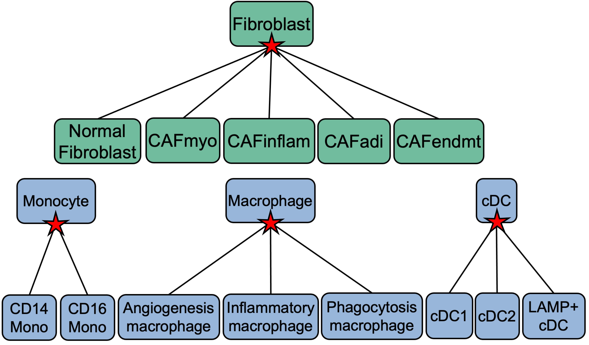
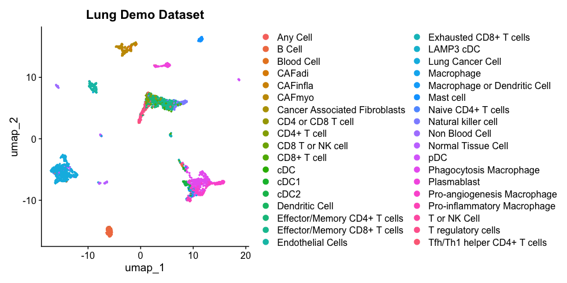

<!-- README.md is generated from README.Rmd. Please edit that file -->

# Pan cancer classification of single cells using scATOMIC

<!-- badges: start -->
<!-- badges: end -->

This repository contains installation instructions and tutorials to run
**S**ingle **C**ell **A**nnotation of **T**um**O**ur
**M**icroenvironments **I**n pan-**C**ancer settings For more
information please check out our manuscript at
<https://www.nature.com/articles/s41467-023-37353-8>
For direct questions please email Ido Nofech-Mozes at [inofechmozes@oicr.on.ca](mailto:inofechmozes@oicr.on.ca)


## Citing scATOMIC

If you are using scATOMIC in your research please cite the corresponding
manuscript: [Nofech-Mozes, et al., Nature
Communications](https://www.nature.com/articles/s41467-023-37353-8)

## Installation and System Requirements

This tutorial has been tested on MacOS (Montery), Linux (Ubuntu 18.04.6
LTS), and Windows. Note: Windows does not natively perform parallel
functions and thus takes longer to run. Note: Mac users require Xcode
Command Line Tools for the installation.

To check if Xcode Command Line Tools are installed run the following in
terminal:

``` bash
xcode-select -p
```

    ## /Library/Developer/CommandLineTools

Install these by running the following in terminal if CommandlLineTools
are not found:

``` bash
xcode-select --install
```

To install scATOMIC you will need to use the devtools package. We
recommend you install other dependencies before installing scATOMIC.
Note that packages DLM and RMagic were removed from CRAN in October 2022
so we install the archived package. Note: In v2 we switch to using a
[fork](https://github.com/inofechm/cutoff.scATOMIC) of the package
[cutoff](https://github.com/choisy/cutoff) where the package name is
changed to avoid conflicting names with the unrelated CRAN cutoff
package. Installation of scATOMIC may take several minutes, as the
package contains the pre-trained random forest models.

``` r
devtools::install_version("dlm", version = "1.1.5", repos = "http://cran.us.r-project.org")
devtools::install_version("Rmagic", version = "2.0.3", repos = "http://cran.us.r-project.org")
if(!require(devtools)) install.packages("devtools")
if(!require(cutoff.scATOMIC)) devtools::install_github("inofechm/cutoff.scATOMIC", force = T)
if(!require(scATOMIC)) devtools::install_github("abelson-lab/scATOMIC")
```

if installation has the error due to the large size of the package:
Error in utils::download.file(url, path, method = method, quiet = quiet,
: download from
‘<https://api.github.com/repos/abelson-lab/scATOMIC/tarball/HEAD>’
failed

Set timeout to longer by running:

``` r
options(timeout=9999999)
devtools::install_github("abelson-lab/scATOMIC")
```

In scATOMIC we use the Rmagic package to impute values.

To use MAGIC, you will need to install both the R and Python packages.

If python or pip are not installed, you will need to install them. We
recommend Miniconda3 to install Python and pip together, or otherwise
you can install pip from <https://pip.pypa.io/en/stable/installing/>.

Installation from CRAN In R, run this command to install MAGIC and all
dependencies:

``` r
if(!require(Rmagic)) devtools::install_version("Rmagic", version = "2.0.3", repos = "http://cran.us.r-project.org")
```

In a terminal, run the following command in command line to install the
Python repository:

``` bash
pip install --user magic-impute
```

Often the python magic module is not loading properly in R and the
following in R is producing FALSE:

``` r
Rmagic::pymagic_is_available()
```

To resolve this issue run:

``` r
library(reticulate)
library(Rmagic)
install.magic()
pymagic_is_available()
```

For more information visit
<https://rdrr.io/cran/Rmagic/f/README.md#installation>

## Whats new in scATOMIC v2

1.  We have updated scATOMIC to classify additional subclasses of cells.
    Specifically, subtypes of macrophages, monocytes, cDCs and cancer
    associated fibroblasts are now included by default.
    

2.  We have added the normal_tissue parameter in the
    create_summary_matrix when inputted samples represent non-cancer, in
    this case any cancer cell label is converted to normal tissue cell.
    [See this new vignette](#Running-scATOMIC-on-normal-tissue-samples)

3.  We have added the known_cancer_type parameter in the
    create_summary_matrix when the cancer type is already known. In this
    case any cancer cell label is converted to the known cancer type.
    [See this new
    vignette](#Running-scATOMIC-on-known-cancer-type-samples)

4.  We have added a low resolution mode to output broader subtypes of
    non malignant cells.

5.  We have switched to using a fork of the cutoff package called
    cutoff.scATOMIC to avoid conflicting package names with the CRAN
    cutoff package.

## Tutorial for scATOMIC

### Applications

Inter-patient cancer cell specific effects can interfere with scATOMICs
cancer signature scoring module and confidence in classifications. We
strongly recommend running scATOMIC only on individual patient/biopsy
samples. For most datasets the scATOMIC should run in \~5-10 minutes on
a standard 16GB RAM laptop. For larger datasets (\> 15,000 cells) we
recommend using a machine with greater RAM. The default scATOMIC model
assumes the presence of at least some cancer cells in a biopsy and
should not be used in normal tissue applications. In version 2 we have
added the normal_tissue parameter for normal tissue samples.

scATOMIC is designed to classify cells within the following pan cancer
TME hierarchy:


We have validated scATOMIC in external datasets of bladder, brain,
breast, colorectal, kidney, liver, lung, neuroblastoma, ovarian,
pancreatic, prostate, sarcoma, and skin cancers. Additionally, one can
apply scATOMIC to bile duct, bone, endometrial, esophageal, gallbladder,
and gastric cancer, however, we have not validated these classes in
external datasets and they may be misclassified as other related
cancers. For a full list of subtypes included in scATOMIC’s reference
see Table S2 in the manuscript.

### Loading dependencies

First we load all dependency packages

``` r
library(scATOMIC)
library(plyr)
library(dplyr)
library(data.table)
library(randomForest)
library(caret)
library(parallel)
library(reticulate)
library(Rmagic)
library(Matrix)
library(Seurat)
library(agrmt)
library(cutoff.scATOMIC)
library(copykat)
library(ggplot2)
```

### Input data

scATOMIC is run directly on gene by cell count matrices. We recommend
running scATOMIC on sparse matrices to speed up performance and save
memory. To convert a regular matrix or dataframe to a sparse matrix run:

``` r
#where input_matrix is any non sparse count matrix
sparse_matrix <- as(as.matrix(input_matrix), "sparseMatrix")
```

To extract raw count sparse matrices directly from Seurat objects run:

``` r
#where seurat_object is any scRNA-seq Seurat object
sparse_matrix <- seurat_object@assays$RNA@counts
```

### Load demo dataset

We included a demo dataset of a primary lung cancer sample within our
package under the object name ‘demo_lung_data’. We store this as a
sparse matrix.

``` r
lung_cancer_demo_data <- demo_lung_data
```

### Preprocessing dataset

We strongly recommend the user filter low quality cells from their
dataset. We recommend to remove any cells with more than 25% of reads
mapping to mitochondrial genes or those with fewer than 500 unique
features expressed. The user can change the pct mt and nFeatureRNA
numbers to suit their own filtering parameters.

``` r
pct_mt <- colSums(lung_cancer_demo_data[grep("^MT-", row.names(lung_cancer_demo_data)),])/colSums(lung_cancer_demo_data) * 100
nFeatureRNA <- colSums(lung_cancer_demo_data > 0)
lung_cancer_demo_data <- lung_cancer_demo_data[, names(which(pct_mt < 25))]
lung_cancer_demo_data <- lung_cancer_demo_data[, intersect(names(which(nFeatureRNA > 500)), colnames(lung_cancer_demo_data))]
```

### Running scATOMIC

To run scATOMIC we use the run_scATOMIC() function to generate a
detailed annotation object. To run with default settings simply use:

``` r
cell_predictions <- run_scATOMIC(lung_cancer_demo_data)
```

Ignore warnings regarding unexpressed genes. Ignore warnings ‘In
xtfrm.data.frame(x) : cannot xtfrm data frames’ This returns a list
object with predictions for each cell at each layer of the hierarchy.

Other relevant parameters of run_scATOMIC are whether to use imputation
(default = TRUE), how many cores to use, and the threshold for
classifying cells.

After running scATOMIC we generate a summary of the intermediate results
with create_summary_matrix(). Here we need to input our prediction list
and the raw count data. By default we set use_CNV to FALSE to avoid CNV
corrections. We set modify_results to TRUE to allow for the assumption
that only one cancer type is in the sample. See ?create_summary_matrix
for information on the other parameters.

create_summary_matrix() returns a matrix that provides the final
classification for each cell as well as the classification at each layer

``` r
results_lung <- create_summary_matrix(prediction_list = cell_predictions, use_CNVs = F, modify_results = T, mc.cores = 1, raw_counts = lung_cancer_demo_data, min_prop = 0.5 )
```

``` r
table(results_lung$scATOMIC_pred)
```

    ## 
    ##                      Any Cell                        B Cell 
    ##                            10                           158 
    ##                    Blood Cell                        CAFadi 
    ##                            10                            13 
    ##                      CAFinfla                        CAFmyo 
    ##                            51                            94 
    ## Cancer Associated Fibroblasts             CD4 or CD8 T cell 
    ##                            24                            21 
    ##                   CD4+ T cell              CD8 T or NK cell 
    ##                            95                            10 
    ##                   CD8+ T cell                           cDC 
    ##                            49                             3 
    ##                          cDC1                          cDC2 
    ##                             9                            56 
    ##                Dendritic Cell  Effector/Memory CD4+ T cells 
    ##                             1                           175 
    ##  Effector/Memory CD8+ T cells             Endothelial Cells 
    ##                           226                           110 
    ##        Exhausted CD8+ T cells                     LAMP3 cDC 
    ##                            30                             3 
    ##              Lung Cancer Cell                    Macrophage 
    ##                           599                            11 
    ##  Macrophage or Dendritic Cell                     Mast cell 
    ##                            35                            80 
    ##            Naive CD4+ T cells           Natural killer cell 
    ##                             6                           101 
    ##                Non Blood Cell            Normal Tissue Cell 
    ##                            66                            69 
    ##                           pDC       Phagocytosis Macrophage 
    ##                            18                           319 
    ##                   Plasmablast   Pro-angiogenesis Macrophage 
    ##                            91                           252 
    ##   Pro-inflammatory Macrophage                  T or NK Cell 
    ##                            28                             2 
    ##            T regulatory cells   Tfh/Th1 helper CD4+ T cells 
    ##                           144                            28

``` r
head(results_lung)
```

    ##                       orig.ident         cell_names
    ## AAACCTGAGACCGGAT-1 SeuratProject AAACCTGAGACCGGAT-1
    ## AAACCTGCAGTCACTA-1 SeuratProject AAACCTGCAGTCACTA-1
    ## AAACCTGGTAAGTAGT-1 SeuratProject AAACCTGGTAAGTAGT-1
    ## AAACCTGTCGAATGCT-1 SeuratProject AAACCTGTCGAATGCT-1
    ## AAACCTGTCTGAGGGA-1 SeuratProject AAACCTGTCTGAGGGA-1
    ## AAACGGGAGTAGATGT-1 SeuratProject AAACGGGAGTAGATGT-1
    ##                                         layer_1                      layer_2
    ## AAACCTGAGACCGGAT-1                   Blood_Cell macrophage_or_dendritic_cell
    ## AAACCTGCAGTCACTA-1                   Blood_Cell           T_or_NK_lymphocyte
    ## AAACCTGGTAAGTAGT-1                   Blood_Cell macrophage_or_dendritic_cell
    ## AAACCTGTCGAATGCT-1 Tissue_Cell_Normal_or_Cancer             Non Stromal Cell
    ## AAACCTGTCTGAGGGA-1                   Blood_Cell                    Mast cell
    ## AAACGGGAGTAGATGT-1 Tissue_Cell_Normal_or_Cancer             Non Stromal Cell
    ##                                   layer_3                   layer_4
    ## AAACCTGAGACCGGAT-1 Macrophage or Monocyte                Macrophage
    ## AAACCTGCAGTCACTA-1      CD4 or CD8 T cell               CD4+ T cell
    ## AAACCTGGTAAGTAGT-1 Macrophage or Monocyte                Macrophage
    ## AAACCTGTCGAATGCT-1 Non GI Epithelial Cell Breast/Lung/Prostate Cell
    ## AAACCTGTCTGAGGGA-1              Mast cell                 Mast cell
    ## AAACGGGAGTAGATGT-1 Non GI Epithelial Cell Breast/Lung/Prostate Cell
    ##                                    layer_5                 layer_6
    ## AAACCTGAGACCGGAT-1 Phagocytosis Macrophage Phagocytosis Macrophage
    ## AAACCTGCAGTCACTA-1             CD4+ T cell             CD4+ T cell
    ## AAACCTGGTAAGTAGT-1 Phagocytosis Macrophage Phagocytosis Macrophage
    ## AAACCTGTCGAATGCT-1        Lung Cancer Cell        Lung Cancer Cell
    ## AAACCTGTCTGAGGGA-1               Mast cell               Mast cell
    ## AAACGGGAGTAGATGT-1        Lung Cancer Cell        Lung Cancer Cell
    ##                    median_score_class_layer_1 median_score_class_layer_2
    ## AAACCTGAGACCGGAT-1                      0.926                      0.998
    ## AAACCTGCAGTCACTA-1                      0.926                      0.858
    ## AAACCTGGTAAGTAGT-1                      0.926                      0.998
    ## AAACCTGTCGAATGCT-1                      0.980                      0.874
    ## AAACCTGTCTGAGGGA-1                      0.926                      0.970
    ## AAACGGGAGTAGATGT-1                      0.980                      0.874
    ##                    median_score_class_layer_3 median_score_class_layer_4
    ## AAACCTGAGACCGGAT-1                      0.984                      1.000
    ## AAACCTGCAGTCACTA-1                      0.996                      0.977
    ## AAACCTGGTAAGTAGT-1                      0.984                      1.000
    ## AAACCTGTCGAATGCT-1                      0.574                      0.812
    ## AAACCTGTCTGAGGGA-1                      0.970                      0.970
    ## AAACGGGAGTAGATGT-1                      0.574                      0.812
    ##                    median_score_class_layer_5 median_score_class_layer_6
    ## AAACCTGAGACCGGAT-1                      1.000                      1.000
    ## AAACCTGCAGTCACTA-1                      0.977                      0.977
    ## AAACCTGGTAAGTAGT-1                      1.000                      1.000
    ## AAACCTGTCGAATGCT-1                      0.872                      0.872
    ## AAACCTGTCTGAGGGA-1                      0.970                      0.970
    ## AAACGGGAGTAGATGT-1                      0.872                      0.872
    ##                              scATOMIC_pred nCount_RNA nFeature_RNA      S.Score
    ## AAACCTGAGACCGGAT-1 Phagocytosis Macrophage       7088         2072 -0.006630921
    ## AAACCTGCAGTCACTA-1             CD4+ T cell       4985         1269 -0.046677709
    ## AAACCTGGTAAGTAGT-1 Phagocytosis Macrophage      10007         2543  0.015462403
    ## AAACCTGTCGAATGCT-1        Lung Cancer Cell      18045         4597 -0.049247934
    ## AAACCTGTCTGAGGGA-1               Mast cell       4937         1492 -0.025618571
    ## AAACGGGAGTAGATGT-1        Lung Cancer Cell      12569         3856 -0.038660836
    ##                       G2M.Score Phase     old.ident RNA_snn_res.0.2
    ## AAACCTGAGACCGGAT-1 -0.047453336    G1 SeuratProject               2
    ## AAACCTGCAGTCACTA-1 -0.006673286    G1 SeuratProject               0
    ## AAACCTGGTAAGTAGT-1  0.063293498   G2M SeuratProject               2
    ## AAACCTGTCGAATGCT-1 -0.064310971    G1 SeuratProject               1
    ## AAACCTGTCTGAGGGA-1 -0.023923499    G1 SeuratProject               9
    ## AAACGGGAGTAGATGT-1 -0.129262025    G1 SeuratProject               1
    ##                    seurat_clusters pan_cancer_cluster classification_confidence
    ## AAACCTGAGACCGGAT-1               2             Normal                 confident
    ## AAACCTGCAGTCACTA-1               0             Normal                 confident
    ## AAACCTGGTAAGTAGT-1               2             Normal                 confident
    ## AAACCTGTCGAATGCT-1               1             Cancer                 confident
    ## AAACCTGTCTGAGGGA-1               9             Normal                 confident
    ## AAACGGGAGTAGATGT-1               1             Cancer                 confident

## scATOMIC CNV mode

To calculate inferred CNV status we offer a built in argument to run
CopyKAT CNV inference. In this mode we run the create_summary_matrix()
function with use_CNVs = TRUE. Note: CNV correction takes significantly
longer than the regular mode of scATOMIC and can be sped up with
parallel computing. We recommend using parallel multi-core processing by
setting the mc.cores argument to the number of cores that can be used.

``` r
results_lung_CNV <- create_summary_matrix(prediction_list = cell_predictions, use_CNVs = T, modify_results = T, mc.cores = 6, raw_counts = lung_cancer_demo_data, min_prop = 0.5 )
```

## Visualizing Results

To visualize the results of scATOMIC we provide the scATOMICTree()
function

``` r
tree_results_lung <- scATOMICTree(predictions_list = cell_predictions, summary_matrix = results_lung, 
                                  interactive_mode = T, collapsed = T, save_results = F,height = 700, width = 1000)
```

This produces an interactive tree for the results. Click on nodes to
expand and reveal subgroups. Hover your mouse over dots to get metrics
(in RStudio Viewer or can save the tree to HTML via the save_results
argument)  
Github .md files do not allow the interactive html file to be embedded
but it can be visualized in the R console or by opening the saved file
in a web browser. This gif demonstrates the interactive mode:


By setting the collapsed argument to FALSE we can generate an
interactive tree that is fully open

``` r
tree_results_lung_open <- scATOMICTree(predictions_list = cell_predictions, summary_matrix = results_lung, 
                                  interactive_mode = T, collapsed = F, save_results = F,height = 700, width = 1000)
```

Github .md files do not allow the interactive mode to be seen but can be
visualized in the R console or by opening the saved file in a web
browser.

By setting the interactive mode to FALSE, we can generate a non
interactive tree

``` r
tree_results_non_interactive <- scATOMICTree(predictions_list = cell_predictions, summary_matrix = results_lung, 
                                  interactive_mode = F, save_results = F)
```

``` r
tree_results_non_interactive
```


## Adding Results to Seurat object

If one wants to visualize the results in a Seurat object we can easily
add the annotations and visualize the results using the DimPlot()
function.

First we create a seurat object with our count matrix We can add our
annotations to the seurat object when we create it

``` r
#create seurat object
lung_seurat <- CreateSeuratObject(lung_cancer_demo_data, meta.data = results_lung)
#run seurat pipeline
lung_seurat <- NormalizeData(lung_seurat)
lung_seurat <- FindVariableFeatures(lung_seurat)
lung_seurat <- ScaleData(lung_seurat)
lung_seurat <- RunPCA(lung_seurat, features = VariableFeatures(object = lung_seurat))
lung_seurat <- RunUMAP(lung_seurat, dims = 1:50)
lung_seurat <- FindNeighbors(lung_seurat)
lung_seurat <- FindClusters(lung_seurat)
```

If you already have a seurat object you can add the results using the
AddMetaData() function

``` r
lung_seurat <- AddMetaData(lung_seurat, results_lung)
```

We can plot our results via:

``` r
DimPlot(lung_seurat, group.by = "scATOMIC_pred") + ggtitle("Lung Demo Dataset") + labs(fill="scATOMIC Annotations") 
```

<!-- -->

## Training new subclassification layers

Given scATOMIC’s modular design, we allow users to add new
subclassification layers for any additional cell type including blood,
cancer, and stromal cells. We provide functions to both train new layers
and to run these subclassifications. As an example we will add a breast
cancer subclassification layer.


Here we use [Wu et
al](https://www.nature.com/articles/s41588-021-00911-1) as a training
dataset, and a sample from [Pal et
al](https://www.embopress.org/doi/full/10.15252/embj.2020107333) as a
testing dataset.

Download training data at
[GSE176078_Wu_etal_2021_BRCA_scRNASeq.tar.gz](https://www.ncbi.nlm.nih.gov/geo/query/acc.cgi?acc=GSE176078)

We unzip these files, and rename count_matrix_barcode.tsv,
count_matrix_genes.tsv, and count_matrix_sparse.mtx to barcodes.tsv,
genes.tsv, and matrix.mtx respectively for the Read10X function to work.

``` r
#test new layer for breast subtyping
#change "~/Downloads" to path containing "Wu_etal_2021_BRCA_scRNASeq/"
Wu_et_al_breast_count_mat <- Seurat::Read10X("~/Downloads/Wu_etal_2021_BRCA_scRNASeq/", gene.column = 1)

#load metadata
Wu_et_al_breast_metadata <- read.csv("~/Downloads/Wu_etal_2021_BRCA_scRNASeq/metadata.csv", row.names = 1)
table(Wu_et_al_breast_metadata$celltype_major)
```

    ## 
    ##           B-cells              CAFs Cancer Epithelial       Endothelial 
    ##              3206              6573             24489              7605 
    ##           Myeloid Normal Epithelial      Plasmablasts               PVL 
    ##              9675              4355              3524              5423 
    ##           T-cells 
    ##             35214

``` r
#filter to only keep cancer cells
cancer_cell_index <- row.names(Wu_et_al_breast_metadata)[which(Wu_et_al_breast_metadata$celltype_major == "Cancer Epithelial")]
Wu_et_al_breast_count_mat <- Wu_et_al_breast_count_mat[,cancer_cell_index]
Wu_et_al_breast_metadata <- Wu_et_al_breast_metadata[cancer_cell_index,]

#remove low quality cells 
Wu_et_al_breast_metadata <- Wu_et_al_breast_metadata[which(Wu_et_al_breast_metadata$percent.mito < 25),]
Wu_et_al_breast_metadata <- Wu_et_al_breast_metadata[which(Wu_et_al_breast_metadata$nFeature_RNA > 500),]
Wu_et_al_breast_count_mat <- Wu_et_al_breast_count_mat[,row.names(Wu_et_al_breast_metadata)]
table(Wu_et_al_breast_metadata$subtype)
```

    ## 
    ##   ER+ HER2+  TNBC 
    ## 11878  1775 10836

We recommend using a high performance compute cluster to train new
models as they can often include large references requiring large memory
usage. For this demo we are taking a sample of the data to speed up
training and run it on a laptop:

``` r
cancer_types <- levels(as.factor(Wu_et_al_breast_metadata$subtype))
#sample 3000 cells from each type if size is greater than 3000
index_subset <- c()
for(i in 1:length(cancer_types)){
  index_cancer <- row.names(Wu_et_al_breast_metadata)[which(Wu_et_al_breast_metadata$subtype == cancer_types[i])]
  if(length(index_cancer) > 3000){
    set.seed(123)
    index_subset <- c(index_subset, index_cancer[sample(1:length(index_cancer), size = 3000)])
  } else{
    index_subset <- c(index_subset, index_cancer)
  }
}
Wu_et_al_breast_count_mat <- Wu_et_al_breast_count_mat[,index_subset]
Wu_et_al_breast_metadata <- Wu_et_al_breast_metadata[index_subset,]
```

To train a new layer we must create a directory to save the model to and
we run the get_new_scATOMIC_layer() function To speed up the demo we use
only 100 trees here

``` r
#change "~/Downloads" to path containing "Wu_etal_2021_BRCA_scRNASeq/"
dir.create("~/Downloads/Wu_etal_2021_BRCA_scRNASeq/breast_subclassification_layer")

breast_cancer_subclassification <- get_new_scATOMIC_layer(training_data = Wu_et_al_breast_count_mat,cell_type_metadata = Wu_et_al_breast_metadata$subtype, output_dir = "~/Downloads/Wu_etal_2021_BRCA_scRNASeq/breast_subclassification_layer/",
                        layer_name = "breast_subclassification", n_cells_replicate = 5000, n_trees = 100)
```

To show how to use the new subclassification layer, we apply it to an
example ER+ tumour, 0125 from Pal et al. Download example matrix at
[GSM4909297](https://www.ncbi.nlm.nih.gov/geo/download/?acc=GSM4909297&format=file&file=GSM4909297%5FER%2DMH0125%2Dmatrix%2Emtx%2Egz).
Additionally download the [features
list](https://www.ncbi.nlm.nih.gov/geo/download/?acc=GSE161529&format=file&file=GSE161529%5Ffeatures%2Etsv%2Egz)
and [barcode
file](https://www.ncbi.nlm.nih.gov/geo/download/?acc=GSM4909297&format=file&file=GSM4909297%5FER%2DMH0125%2Dbarcodes%2Etsv%2Egz).
Move these files into a folder named Pal_et_al_ER_0125 and name them
matrix.mtx.gz, features.tsv.gz, and barcodes.tsv.gz respectively.

We read and filter this dataset.

``` r
#change "~/Downloads" to path containing "Wu_etal_2021_BRCA_scRNASeq/"
Pal_0125 <- Read10X("~/Downloads/Pal_et_al_ER_0125/")

pct_mt <- colSums(Pal_0125[grep("^MT-", row.names(Pal_0125)),])/colSums(Pal_0125) * 100
nFeatureRNA <- apply(Pal_0125, 2,function(x){length(which(x != 0))})
Pal_0125 <- Pal_0125[, names(which(pct_mt < 25))]
Pal_0125 <- Pal_0125[, intersect(names(which(nFeatureRNA > 500)), colnames(Pal_0125))]
```

First we use the base scATOMIC model to classify the cells in the data.

``` r
predictions_Pal_0125 <- run_scATOMIC(Pal_0125)
results_Pal_0125 <- create_summary_matrix(prediction_list = predictions_Pal_0125, raw_counts = Pal_0125)
table(results_Pal_0125$scATOMIC_pred)
```

We now want to use our new subclassification layer to further subtype
the breast cancer cells identified. We do this with the
classify_new_scATOMIC_layer() function.

``` r
#define breast cancer cells
cells_to_subclassify <- row.names(results_Pal_0125)[which(
  results_Pal_0125$scATOMIC_pred == "Breast Cancer Cell")]

breast_subclassifications <- classify_new_scATOMIC_layer(rf_model = breast_cancer_subclassification[["rf_classifier"]], selected_features = breast_cancer_subclassification[["selected_features"]],
                                                         rna_counts = Pal_0125, cell_names = cells_to_subclassify, layer_name = "Breast Cancer Cells", mc.cores = 1, imputation = T, confidence_cutoff = T  )

table(breast_subclassifications$predicted_tissue_with_cutoff)

#add new classifications to results matrix
results_Pal_0125[row.names(breast_subclassifications), "scATOMIC_pred"] <- breast_subclassifications$predicted_tissue_with_cutoff
```

``` r
table(results_Pal_0125$scATOMIC_pred)
```

    ## 
    ##                                   Any Cell 
    ##                                          8 
    ##                                 Blood Cell 
    ##                                         30 
    ##                                     CAFadi 
    ##                                         23 
    ##                                   CAFendmt 
    ##                                          1 
    ##                                   CAFinfla 
    ##                                         65 
    ##                                     CAFmyo 
    ##                                         25 
    ##              Cancer Associated Fibroblasts 
    ##                                         29 
    ##                          CD4 or CD8 T cell 
    ##                                          5 
    ##                                       cDC1 
    ##                                          2 
    ##                                       cDC2 
    ##                                         34 
    ##               Effector/Memory CD4+ T cells 
    ##                                          6 
    ##               Effector/Memory CD8+ T cells 
    ##                                         29 
    ##                          Endothelial Cells 
    ##                                         16 
    ##                                        ER+ 
    ##                                       3677 
    ##               Macrophage or Dendritic Cell 
    ##                                          2 
    ##                         Naive CD4+ T cells 
    ##                                         13 
    ##                        Natural killer cell 
    ##                                          3 
    ##                             Non Blood Cell 
    ##                                         38 
    ##                          Normal Fibroblast 
    ##                                         60 
    ##                         Normal Tissue Cell 
    ##                                        123 
    ##                    Phagocytosis Macrophage 
    ##                                         34 
    ##                Pro-angiogenesis Macrophage 
    ##                                          2 
    ##                         T regulatory cells 
    ##                                          7 
    ##                Tfh/Th1 helper CD4+ T cells 
    ##                                          1 
    ## Unclassified_Cell_from_Breast Cancer Cells 
    ##                                          4

The breast cancer cells are now classified as ER+ cells.

## Running scATOMIC on normal tissue samples

Although scATOMIC is designed for cancer samples, one can use it to
annotate non-cancerous samples. This can be particularly useful in the
context of comparing tumour microenvironments to normal tissue
environments where both data would be annotated in the same way.

In this example we use a matched normal lung sample downloaded from [Kim
et al](https://www.nature.com/articles/s41467-020-16164-1) For the
convenience of this tutorial, the count matrix in h5 format can be
downloaded from this [Google Drive
link](https://drive.google.com/file/d/1EPljBN5l5txqAr2j8hiuc4rAWRoGVOXL/view?usp=sharing)

Run the standard pipeline for scATOMIC

``` r
normal_lungdata <- Read10X_h5("~/Downloads/LUNG_N01_sparse_count_mat.h5")

pct_mt <- colSums(normal_lungdata[grep("^MT-", row.names(normal_lungdata)),])/colSums(normal_lungdata) * 100
nFeatureRNA <- colSums(normal_lungdata > 0)
normal_lungdata <- normal_lungdata[, names(which(pct_mt < 25))]
normal_lungdata <- normal_lungdata[, intersect(names(which(nFeatureRNA > 500)), colnames(normal_lungdata))]
cell_predictions_normal_lung <- run_scATOMIC(normal_lungdata)
results_normal_lung <- create_summary_matrix(prediction_list = cell_predictions_normal_lung,  raw_counts = normal_lungdata, normal_tissue = T)
```

As you can see there are no cancer cells labelled.

``` r
table(results_normal_lung$scATOMIC_pred)
```

    ## 
    ##                     Any Cell                       B Cell 
    ##                            5                           43 
    ##                   Blood Cell            CD4 or CD8 T cell 
    ##                           68                           23 
    ##                  CD4+ T cell             CD8 T or NK cell 
    ##                           17                           30 
    ##                  CD8+ T cell                          cDC 
    ##                           17                            5 
    ##                         cDC1                         cDC2 
    ##                           10                          112 
    ## Effector/Memory CD4+ T cells Effector/Memory CD8+ T cells 
    ##                          148                          617 
    ##            Endothelial Cells                    LAMP3 cDC 
    ##                           30                           13 
    ##                   Macrophage Macrophage or Dendritic Cell 
    ##                          170                           28 
    ##                   MAIT cells                    Mast cell 
    ##                            1                          220 
    ##           Naive CD4+ T cells          Natural killer cell 
    ##                            2                          394 
    ##            Normal Fibroblast           Normal Tissue Cell 
    ##                           44                          167 
    ##                          pDC      Phagocytosis Macrophage 
    ##                           31                           64 
    ##  Pro-angiogenesis Macrophage  Pro-inflammatory Macrophage 
    ##                          662                          247 
    ##                 Stromal Cell                 T or NK Cell 
    ##                            1                            1 
    ##           T regulatory cells 
    ##                            7

All cells that received a classification that was referring to a cancer
cell type in layer 6 was converted to normal tissue cell in scATOMIC’s
final prediction

``` r
table(results_normal_lung[which(results_normal_lung$scATOMIC_pred == "Normal Tissue Cell"), "layer_6"])
```

    ## 
    ## Breast/Lung/Prostate      Epithelial Cell     Lung Cancer Cell 
    ##                    2                    5                  147 
    ##       Non Blood Cell     Non Stromal Cell 
    ##                    6                    7

## Running scATOMIC on known cancer type samples

Although scATOMIC can predict cancer type well without any prior
knowledge, not all cancer types are captured in the training model and
it can occasionally make misclassifications. As such we now allows users
to input a ground truth for the cancer type if it is known using the
known_cancer_type parameter in the create_summary_matrix function.

We showcase this functionality in the demo_lung_cancer dataset. In this
example we provide the function knowledge that the sample is “LUAD”

``` r
lung_cancer_demo_data <- demo_lung_data
pct_mt <- colSums(lung_cancer_demo_data[grep("^MT-", row.names(lung_cancer_demo_data)),])/colSums(lung_cancer_demo_data) * 100
nFeatureRNA <- colSums(lung_cancer_demo_data > 0)
lung_cancer_demo_data <- lung_cancer_demo_data[, names(which(pct_mt < 25))]
lung_cancer_demo_data <- lung_cancer_demo_data[, intersect(names(which(nFeatureRNA > 500)), colnames(lung_cancer_demo_data))]
cell_predictions <- run_scATOMIC(lung_cancer_demo_data)
results_lung <- create_summary_matrix(prediction_list = cell_predictions, raw_counts = lung_cancer_demo_data, known_cancer_type = "LUAD cell" )
```

``` r
table(results_lung$scATOMIC_pred)
```

    ## 
    ##                      Any Cell                        B Cell 
    ##                            10                           158 
    ##                    Blood Cell                        CAFadi 
    ##                            10                            13 
    ##                      CAFinfla                        CAFmyo 
    ##                            51                            94 
    ## Cancer Associated Fibroblasts             CD4 or CD8 T cell 
    ##                            24                            21 
    ##                   CD4+ T cell              CD8 T or NK cell 
    ##                            95                             8 
    ##                   CD8+ T cell                           cDC 
    ##                            46                             3 
    ##                          cDC1                          cDC2 
    ##                             9                            56 
    ##                Dendritic Cell  Effector/Memory CD4+ T cells 
    ##                             1                           175 
    ##  Effector/Memory CD8+ T cells             Endothelial Cells 
    ##                           231                           110 
    ##        Exhausted CD8+ T cells                     LAMP3 cDC 
    ##                            30                             3 
    ##                     LUAD cell                    Macrophage 
    ##                           599                            11 
    ##  Macrophage or Dendritic Cell                     Mast cell 
    ##                            35                            80 
    ##            Naive CD4+ T cells           Natural killer cell 
    ##                             6                           101 
    ##                Non Blood Cell            Normal Tissue Cell 
    ##                            66                            69 
    ##                           pDC       Phagocytosis Macrophage 
    ##                            18                           319 
    ##                   Plasmablast   Pro-angiogenesis Macrophage 
    ##                            91                           252 
    ##   Pro-inflammatory Macrophage                  T or NK Cell 
    ##                            28                             2 
    ##            T regulatory cells   Tfh/Th1 helper CD4+ T cells 
    ##                           144                            28

## Other Considerations

### Forced full classifications

To bypass any classification score cutoffs and force a terminal
specialized classification for each cell use run_scATOMIC() and
create_summary_matrix() with the confidence_cutoff argument as FALSE.

### Breast subclassification mode

We included a native breast cancer subclassification module. To run
breast subclassification, set the breast_mode argument to TRUE in both
run_scATOMIC() and create_summary_matrix().

### Adding layers not in hierarchy

If one would like to add additional layers not within the existing
hierarchy please contact us directly as it likely requires retraining
the base model.

### Session Info

``` r
sessionInfo()
```

    ## R version 4.2.2 (2022-10-31)
    ## Platform: x86_64-apple-darwin17.0 (64-bit)
    ## Running under: macOS Big Sur ... 10.16
    ## 
    ## Matrix products: default
    ## BLAS:   /Library/Frameworks/R.framework/Versions/4.2/Resources/lib/libRblas.0.dylib
    ## LAPACK: /Library/Frameworks/R.framework/Versions/4.2/Resources/lib/libRlapack.dylib
    ## 
    ## locale:
    ## [1] en_US.UTF-8/en_US.UTF-8/en_US.UTF-8/C/en_US.UTF-8/en_US.UTF-8
    ## 
    ## attached base packages:
    ## [1] parallel  stats     graphics  grDevices utils     datasets  methods  
    ## [8] base     
    ## 
    ## other attached packages:
    ##  [1] copykat_1.1.0           cutoff.scATOMIC_0.1.0   agrmt_1.42.8           
    ##  [4] Seurat_4.9.9.9041       SeuratObject_4.9.9.9081 sp_1.5-1               
    ##  [7] Rmagic_2.0.3            Matrix_1.5-3            reticulate_1.27        
    ## [10] caret_6.0-93            lattice_0.20-45         ggplot2_3.4.0          
    ## [13] randomForest_4.7-1.1    data.table_1.14.6       dplyr_1.0.10           
    ## [16] plyr_1.8.8              scATOMIC_2.0.0         
    ## 
    ## loaded via a namespace (and not attached):
    ##   [1] spam_2.9-1             igraph_1.3.5           lazyeval_0.2.2        
    ##   [4] splines_4.2.2          RcppHNSW_0.4.1         listenv_0.9.0         
    ##   [7] scattermore_0.8        amap_0.8-19            digest_0.6.31         
    ##  [10] foreach_1.5.2          htmltools_0.5.4        fansi_1.0.3           
    ##  [13] magrittr_2.0.3         tensor_1.5             cluster_2.1.4         
    ##  [16] ROCR_1.0-11            recipes_1.0.3          globals_0.16.2        
    ##  [19] gower_1.0.1            matrixStats_0.63.0     R.utils_2.12.2        
    ##  [22] bdsmatrix_1.3-6        hardhat_1.2.0          timechange_0.1.1      
    ##  [25] spatstat.sparse_3.0-0  colorspace_2.0-3       ggrepel_0.9.2         
    ##  [28] xfun_0.36              jsonlite_1.8.4         progressr_0.12.0      
    ##  [31] spatstat.data_3.0-0    survival_3.4-0         zoo_1.8-11            
    ##  [34] iterators_1.0.14       glue_1.6.2             polyclip_1.10-4       
    ##  [37] gtable_0.3.1           ipred_0.9-13           leiden_0.4.3          
    ##  [40] future.apply_1.10.0    abind_1.4-5            scales_1.2.1          
    ##  [43] mvtnorm_1.1-3          data.tree_1.0.0        DBI_1.1.3             
    ##  [46] spatstat.random_3.0-1  miniUI_0.1.1.1         Rcpp_1.0.9            
    ##  [49] viridisLite_0.4.1      xtable_1.8-4           bit_4.0.5             
    ##  [52] dotCall64_1.0-2        stats4_4.2.2           lava_1.7.1            
    ##  [55] prodlim_2019.11.13     htmlwidgets_1.6.1      httr_1.4.4            
    ##  [58] DiagrammeR_1.0.9       RColorBrewer_1.1-3     ellipsis_0.3.2        
    ##  [61] ica_1.0-3              R.methodsS3_1.8.2      farver_2.1.1          
    ##  [64] pkgconfig_2.0.3        uwot_0.1.14            nnet_7.3-18           
    ##  [67] deldir_1.0-6           utf8_1.2.2             here_1.0.1            
    ##  [70] labeling_0.4.2         tidyselect_1.2.0       rlang_1.0.6           
    ##  [73] reshape2_1.4.4         later_1.3.0            visNetwork_2.1.2      
    ##  [76] munsell_0.5.0          tools_4.2.2            cli_3.6.0             
    ##  [79] generics_0.1.3         ggridges_0.5.4         evaluate_0.19         
    ##  [82] stringr_1.5.0          fastmap_1.1.0          tree_1.0-42           
    ##  [85] yaml_2.3.6             goftest_1.2-3          bit64_4.0.5           
    ##  [88] ModelMetrics_1.2.2.2   knitr_1.41             fitdistrplus_1.1-8    
    ##  [91] purrr_1.0.0            RANN_2.6.1             pbapply_1.6-0         
    ##  [94] future_1.30.0          nlme_3.1-161           mime_0.12             
    ##  [97] R.oo_1.25.0            hdf5r_1.3.7            compiler_4.2.2        
    ## [100] rstudioapi_0.14        plotly_4.10.1          png_0.1-8             
    ## [103] spatstat.utils_3.0-1   tibble_3.1.8           stringi_1.7.8         
    ## [106] highr_0.10             RSpectra_0.16-1        vctrs_0.5.1           
    ## [109] pillar_1.8.1           lifecycle_1.0.3        spatstat.geom_3.0-3   
    ## [112] lmtest_0.9-40          RcppAnnoy_0.0.20       cowplot_1.1.1         
    ## [115] irlba_2.3.5.1          httpuv_1.6.7           patchwork_1.1.2       
    ## [118] R6_2.5.1               promises_1.2.0.1       KernSmooth_2.23-20    
    ## [121] gridExtra_2.3          parallelly_1.33.0      codetools_0.2-18      
    ## [124] fastDummies_1.6.3      MASS_7.3-58.1          assertthat_0.2.1      
    ## [127] rprojroot_2.0.3        withr_2.5.0            sctransform_0.3.5     
    ## [130] collapsibleTree_0.1.7  grid_4.2.2             rpart_4.1.19          
    ## [133] timeDate_4022.108      tidyr_1.2.1            class_7.3-20          
    ## [136] rmarkdown_2.19         Rtsne_0.16             bbmle_1.0.25          
    ## [139] spatstat.explore_3.0-5 pROC_1.18.0            numDeriv_2016.8-1.1   
    ## [142] shiny_1.7.4            lubridate_1.9.0
