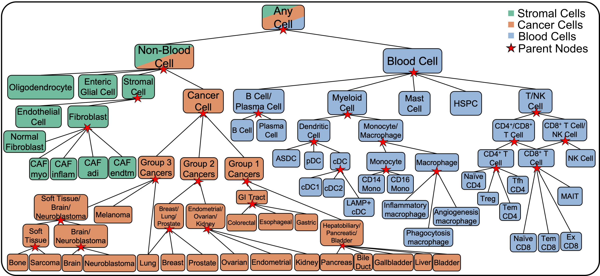
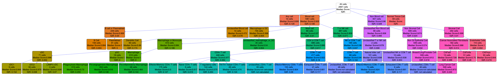
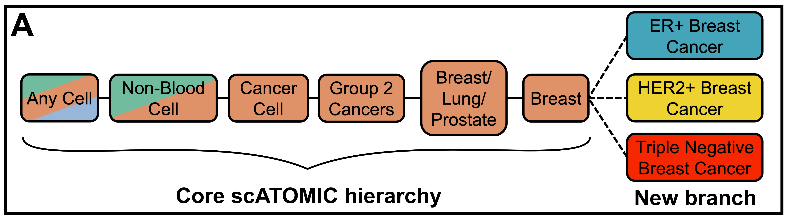

<!-- README.md is generated from README.Rmd. Please edit that file -->

# scATOMIC

<!-- badges: start -->
<!-- badges: end -->

**S**ingle **C**ell **A**nnotation of **T**um**O**ur
**M**icroenvironments **I**n pan-**C**ancer settings


## Installation

To install scATOMIC you will need to use the devtools package. We
recommend you install other dependencies first. Note: The package
“cutoff” we use is a developer package that is different from the CRAN
“cutoff” package.

``` r
if(!require(devtools)) install.packages("devtools")
if(!require(cutoff)) devtools::install_github("choisy/cutoff")
if(!require(scATOMIC)) devtools::install_github("abelson-lab/scATOMIC")
```

In scATOMIC we rely on the Rmagic package to impute values.

To use MAGIC, you will need to install both the R and Python packages.

If python or pip are not installed, you will need to install them. We
recommend Miniconda3 to install Python and pip together, or otherwise
you can install pip from <https://pip.pypa.io/en/stable/installing/>.

Installation from CRAN In R, run this command to install MAGIC and all
dependencies:

``` r
if(!require(Rmagic)) install.packages("Rmagic")
```

In a terminal, run the following command to install the Python
repository:

pip install –user magic-impute

If the python magic module is not loading properly and the following is
producing FALSE:

``` r
Rmagic::pymagic_is_available()
```

Run to resolve the issue:

``` r
library(reticulate)
library(Rmagic)
install.magic()
pymagic_is_available()
```

For more information visit
<https://rdrr.io/cran/Rmagic/f/README.md#installation>

## Tutorial for scATOMIC

### Applications

scATOMIC is designed to classify cells within the pan cancer TME
hierarchy:



We have validated scATOMIC in external datasets of bladder, brain,
breast, colorectal, kidney, liver, lung, neuroblastoma, ovarian,
pancreatic, prostate, sarcoma, and skin cancers. Additionally, one can
apply scATOMIC to bile duct, bone, endometrial, esophageal, gallbladder,
and gastric cancer, however, we have not validated these classes in
external datasets and they may be misclassified as other related
cancers. For a full list of subtypes included in scATOMIC’s reference
see Table S2 in the manuscript.

### Loading dependencies

First we load all needed packages

``` r
library(scATOMIC)
library(plyr)
library(dplyr)
library(data.table)
library(randomForest)
library(caret)
library(parallel)
library(reticulate)
library(Rmagic)
library(Matrix)
library(Seurat)
library(agrmt)
library(cutoff)
library(copykat)
library(ggplot2)
```

### Input data

scATOMIC is run directly on gene by cell count matrices. We recommend
running scATOMIC on sparse matrices to speed up performance and save
memory. To convert a regular matrix or dataframe to a sparse matrix run:

``` r
#where input_matrix is any non sparse count matrix
sparse_matrix <- as(as.matrix(input_matrix), "sparseMatrix")
```

To extract raw count sparse matrices from Seurat objects run:

``` r
#where seurat_object is any scRNA-seq Seurat object
sparse_matrix <- seurat_object@assays$RNA@counts
```

### Load demo dataset

We included a demo dataset of a primary lung cancer sample within our
package under the object name ‘demo\_lung\_data’. We store this as a
sparse matrix.

``` r
lung_cancer_demo_data <- demo_lung_data
```

### Preprocessing dataset

We strongly recommend the user filter low quality cells from their
dataset. We recommend to remove any cells with more than 25% of reads
mapping to mitochondrial genes or those with fewer than 500 unique
features expressed. The user can change the pct mt and nFeatureRNA
numbers to suit their own filtering parameters.

``` r
pct_mt <- colSums(lung_cancer_demo_data[grep("^MT-", row.names(lung_cancer_demo_data)),])/colSums(lung_cancer_demo_data) * 100
nFeatureRNA <- apply(lung_cancer_demo_data, 2,function(x){length(which(x != 0))})
lung_cancer_demo_data <- lung_cancer_demo_data[, names(which(pct_mt < 25))]
lung_cancer_demo_data <- lung_cancer_demo_data[, intersect(names(which(nFeatureRNA > 500)), colnames(lung_cancer_demo_data))]
```

### Running scATOMIC

To run scATOMIC we use the run\_scATOMIC() function to generate a
detailed annotation object. To run with default settings simply use:

``` r
cell_predictions <- run_scATOMIC(lung_cancer_demo_data)
```

Ignore warnings regarding unexpressed genes. This returns a list object
with predictions for each cell at each layer of the hierarchy.

Other relevant parameters of run\_scATOMIC whether to use imputation
(default = TRUE), how many cores to use, and the threshold for
classifying cells.

After running scATOMIC we generate a summary of the intermediate results
with create\_summary\_matrix(). Here we need to input our prediction
list and the raw count data. By default we set use\_CNV to FALSE to
avoid CNV corrections. We set modify\_results to TRUE to allow for the
assumption that only one cancer type is in the sample. See
?create\_summary\_matrix for information on the other parameters.

create\_summary\_matrix() returns a matrix that provides the final
classification for each cell as well as the classification at each layer

``` r
results_lung <- create_summary_matrix(prediction_list = cell_predictions, use_CNVs = F, modify_results = T, mc.cores = 1, raw_counts = lung_cancer_demo_data, min_prop = 0.5 )
```

``` r
table(results_lung$scATOMIC_pred)
```

    ## 
    ##                     Any Cell                       B cell 
    ##                          101                          162 
    ##                   Blood Cell            CD4 or CD8 T cell 
    ##                            7                            4 
    ##                  CD4+ T cell             CD8 T or NK cell 
    ##                          411                           36 
    ##                  CD8+ T cell                          cDC 
    ##                          339                          223 
    ##               Dendritic Cell            Endothelial Cells 
    ##                            1                          109 
    ##                  Fibroblasts             Lung Cancer Cell 
    ##                           89                          604 
    ##                   Macrophage Macrophage or Dendritic Cell 
    ##                          281                          209 
    ##          Natural killer cell               Non Blood Cell 
    ##                          100                           64 
    ##           Normal Tissue Cell                          pDC 
    ##                           65                           18 
    ##                  Plasmablast          Smooth Muscle Cells 
    ##                           80                           93 
    ##                 T or NK Cell 
    ##                            1

``` r
head(results_lung)
```

    ##                       orig.ident nCount_RNA nFeature_RNA         cell_names
    ## AAACCTGAGACCGGAT-1 SeuratProject       7088         2072 AAACCTGAGACCGGAT-1
    ## AAACCTGCAGTCACTA-1 SeuratProject       4985         1269 AAACCTGCAGTCACTA-1
    ## AAACCTGGTAAGTAGT-1 SeuratProject      10007         2543 AAACCTGGTAAGTAGT-1
    ## AAACCTGTCGAATGCT-1 SeuratProject      18045         4597 AAACCTGTCGAATGCT-1
    ## AAACCTGTCTGAGGGA-1 SeuratProject       4937         1492 AAACCTGTCTGAGGGA-1
    ## AAACGGGAGTAGATGT-1 SeuratProject      12569         3856 AAACGGGAGTAGATGT-1
    ##                                         layer_1                      layer_2
    ## AAACCTGAGACCGGAT-1                   Blood_Cell macrophage_or_dendritic_cell
    ## AAACCTGCAGTCACTA-1                   Blood_Cell           T_or_NK_lymphocyte
    ## AAACCTGGTAAGTAGT-1                   Blood_Cell macrophage_or_dendritic_cell
    ## AAACCTGTCGAATGCT-1 Tissue_Cell_Normal_or_Cancer             Non Stromal Cell
    ## AAACCTGTCTGAGGGA-1        unclassified_any_cell        unclassified_any_cell
    ## AAACGGGAGTAGATGT-1 Tissue_Cell_Normal_or_Cancer             Non Stromal Cell
    ##                                          layer_3                       layer_4
    ## AAACCTGAGACCGGAT-1                    Macrophage                    Macrophage
    ## AAACCTGCAGTCACTA-1             CD4 or CD8 T cell                   CD4+ T cell
    ## AAACCTGGTAAGTAGT-1 unclassified_macrophage_or_DC unclassified_macrophage_or_DC
    ## AAACCTGTCGAATGCT-1        Non GI Epithelial Cell     Breast/Lung/Prostate Cell
    ## AAACCTGTCTGAGGGA-1         unclassified_any_cell         unclassified_any_cell
    ## AAACGGGAGTAGATGT-1        Non GI Epithelial Cell     Breast/Lung/Prostate Cell
    ##                                          layer_5                      layer_6
    ## AAACCTGAGACCGGAT-1                    Macrophage                   Macrophage
    ## AAACCTGCAGTCACTA-1                   CD4+ T cell                  CD4+ T cell
    ## AAACCTGGTAAGTAGT-1 unclassified_macrophage_or_DC Macrophage or Dendritic Cell
    ## AAACCTGTCGAATGCT-1              Lung Cancer Cell             Lung Cancer Cell
    ## AAACCTGTCTGAGGGA-1         unclassified_any_cell                     Any Cell
    ## AAACGGGAGTAGATGT-1              Lung Cancer Cell             Lung Cancer Cell
    ##                                   scATOMIC_pred      S.Score    G2M.Score Phase
    ## AAACCTGAGACCGGAT-1                   Macrophage -0.006630921 -0.047453336    G1
    ## AAACCTGCAGTCACTA-1                  CD4+ T cell -0.046677709 -0.006673286    G1
    ## AAACCTGGTAAGTAGT-1 Macrophage or Dendritic Cell  0.015462403  0.063293498   G2M
    ## AAACCTGTCGAATGCT-1             Lung Cancer Cell -0.049247934 -0.064310971    G1
    ## AAACCTGTCTGAGGGA-1                     Any Cell -0.025618571 -0.023923499    G1
    ## AAACGGGAGTAGATGT-1             Lung Cancer Cell -0.038660836 -0.129262025    G1
    ##                        old.ident RNA_snn_res.0.2 seurat_clusters
    ## AAACCTGAGACCGGAT-1 SeuratProject               2               2
    ## AAACCTGCAGTCACTA-1 SeuratProject               0               0
    ## AAACCTGGTAAGTAGT-1 SeuratProject               2               2
    ## AAACCTGTCGAATGCT-1 SeuratProject               1               1
    ## AAACCTGTCTGAGGGA-1 SeuratProject               9               9
    ## AAACGGGAGTAGATGT-1 SeuratProject               1               1
    ##                    pan_cancer_cluster
    ## AAACCTGAGACCGGAT-1             Normal
    ## AAACCTGCAGTCACTA-1             Normal
    ## AAACCTGGTAAGTAGT-1             Normal
    ## AAACCTGTCGAATGCT-1             Cancer
    ## AAACCTGTCTGAGGGA-1             Normal
    ## AAACGGGAGTAGATGT-1             Cancer

## scATOMIC CNV mode

To calculate inferred CNV status we offer a built in argument to run
CopyKAT CNV inference. In this mode we run the create\_summary\_matrix()
function with use\_CNVs = TRUE. Note: CNV correction takes significantly
longer than the regular mode of scATOMIC and can be sped up with
parallel computing. We recommend using parallel multi-core processing by
setting the mc.cores argument to the number of cores that can be used.

``` r
results_lung_CNV <- create_summary_matrix(prediction_list = cell_predictions, use_CNVs = T, modify_results = T, mc.cores = 6, raw_counts = lung_cancer_demo_data, min_prop = 0.5 )
```

## Visualizing Results

To visualize the results of scATOMIC we provide the scATOMICTree()
function

``` r
tree_results_lung <- scATOMICTree(predictions_list = cell_predictions, summary_matrix = results_lung, 
                                  interactive_mode = T, collapsed = T, save_results = F,height = 700, width = 1000)
```

This produces an interactive tree for the results. Click on nodes to
expand and reveal subgroups. Hover your mouse over dots to get metrics
(in RStudio Viewer or can save the tree to HTML via the save\_results
argument)  
Github .md files do not allow the interactive html file to be embedded
but it can be visualized in the R console or by opening the saved file
in a web browser. This gif demonstrates the interactive mode:


By setting the collapsed argument to FALSE we can generate an
interactive tree that is fully open

``` r
tree_results_lung_open <- scATOMICTree(predictions_list = cell_predictions, summary_matrix = results_lung, 
                                  interactive_mode = T, collapsed = F, save_results = F,height = 700, width = 1000)
```

Github .md files do not allow the interactive mode to be seen but can be
visualized in the R console or by opening the saved file in a web
browser.

By setting the interactive mode to FALSE, we can generate a non
interactive tree

``` r
tree_results_non_interactive <- scATOMICTree(predictions_list = cell_predictions, summary_matrix = results_lung, 
                                  interactive_mode = F, save_results = F)
```

``` r
tree_results_non_interactive
```



## Adding Results to Seurat object

If one wants to visualize the results in a Seurat object we can easily
add the annotations and visualize the results using the DimPlot()
function.

First we create a seurat object with our count matrix We can add our
annotations to the seurat object when we create it

``` r
#create seurat object
lung_seurat <- CreateSeuratObject(lung_cancer_demo_data, meta.data = results_lung)
#run seurat pipeline
lung_seurat <- NormalizeData(lung_seurat)
lung_seurat <- FindVariableFeatures(lung_seurat)
lung_seurat <- ScaleData(lung_seurat)
lung_seurat <- RunPCA(lung_seurat, features = VariableFeatures(object = lung_seurat))
lung_seurat <- RunUMAP(lung_seurat, dims = 1:50)
lung_seurat <- FindNeighbors(lung_seurat)
lung_seurat <- FindClusters(lung_seurat)
```

If you already have a seurat object you can add the results using the
AddMetaData() function

``` r
lung_seurat <- AddMetaData(lung_seurat, results_lung)
```

We can plot our results via:

``` r
DimPlot(lung_seurat, group.by = "scATOMIC_pred", ) + ggtitle("Lung Demo Dataset") + labs(fill="scATOMIC Annotations") 
```

<!-- -->

## Training new subclassification layers

Given scATOMIC’s modular design, we allow users to add new
subclassification layers for any additional cell type including blood,
cancer, and stromal cells. We provide functions to both train new layers
and to run these subclassifications. As an example we will add a breast
cancer subclassification layer.



Here we use [Wu et
al](https://www.nature.com/articles/s41588-021-00911-1) as a training
dataset, and a sample from [Pal et
al](https://www.embopress.org/doi/full/10.15252/embj.2020107333) as a
testing dataset.

Download training data at
[GSE176078\_Wu\_etal\_2021\_BRCA\_scRNASeq.tar.gz](https://www.ncbi.nlm.nih.gov/geo/query/acc.cgi?acc=GSE176078)

We unzip these files, and rename count\_matrix\_barcode.tsv,
count\_matrix\_genes.tsv, and count\_matrix\_sparse.mtx to barcodes.tsv,
genes.tsv, and matrix.mtx respectively for the Read10X function to work.

``` r
#test new layer for breast subtyping
#change "~/Downloads" to path containing "Wu_etal_2021_BRCA_scRNASeq/"
Wu_et_al_breast_count_mat <- Seurat::Read10X("~/Downloads/Wu_etal_2021_BRCA_scRNASeq/", gene.column = 1)

#load metadata
Wu_et_al_breast_metadata <- read.csv("~/Downloads/Wu_etal_2021_BRCA_scRNASeq/metadata.csv", row.names = 1)
table(Wu_et_al_breast_metadata$celltype_major)
```

    ## 
    ##           B-cells              CAFs Cancer Epithelial       Endothelial 
    ##              3206              6573             24489              7605 
    ##           Myeloid Normal Epithelial      Plasmablasts               PVL 
    ##              9675              4355              3524              5423 
    ##           T-cells 
    ##             35214

``` r
#filter to only keep cancer cells
cancer_cell_index <- row.names(Wu_et_al_breast_metadata)[which(Wu_et_al_breast_metadata$celltype_major == "Cancer Epithelial")]
Wu_et_al_breast_count_mat <- Wu_et_al_breast_count_mat[,cancer_cell_index]
Wu_et_al_breast_metadata <- Wu_et_al_breast_metadata[cancer_cell_index,]

#remove low quality cells 
Wu_et_al_breast_metadata <- Wu_et_al_breast_metadata[which(Wu_et_al_breast_metadata$percent.mito < 25),]
Wu_et_al_breast_metadata <- Wu_et_al_breast_metadata[which(Wu_et_al_breast_metadata$nFeature_RNA > 500),]
Wu_et_al_breast_count_mat <- Wu_et_al_breast_count_mat[,row.names(Wu_et_al_breast_metadata)]
table(Wu_et_al_breast_metadata$subtype)
```

    ## 
    ##   ER+ HER2+  TNBC 
    ## 11878  1775 10836

To train a new layer we must create a directory to save the model to and
we run the get\_new\_scATOMIC\_layer() function

``` r
#change "~/Downloads" to path containing "Wu_etal_2021_BRCA_scRNASeq/"
dir.create("~/Downloads/Wu_etal_2021_BRCA_scRNASeq/breast_subclassification_layer")

breast_cancer_subclassification <- get_new_scATOMIC_layer(training_data = Wu_et_al_breast_count_mat,cell_type_metadata = Wu_et_al_breast_metadata$subtype, output_dir = "~/Downloads/Wu_etal_2021_BRCA_scRNASeq/breast_subclassification_layer/",
                       mc_cores = 6, layer_name = "breast_subclassification", n_cells_replicate = 10000, n_trees = 500)
```

To show how to use the new subclassification layer, we apply it to an
example ER+ tumour, 0125 from Pal et al. Download example matrix at
[GSM4909297](https://www.ncbi.nlm.nih.gov/geo/download/?acc=GSM4909297&format=file&file=GSM4909297%5FER%2DMH0125%2Dmatrix%2Emtx%2Egz).
Additionally download the [features
list](https://www.ncbi.nlm.nih.gov/geo/download/?acc=GSE161529&format=file&file=GSE161529%5Ffeatures%2Etsv%2Egz)
and [barcode
file](https://www.ncbi.nlm.nih.gov/geo/download/?acc=GSM4909297&format=file&file=GSM4909297%5FER%2DMH0125%2Dbarcodes%2Etsv%2Egz).
Move these files into a folder named Pal\_et\_al\_ER\_0125 and name them
matrix.mtx.gz, features.tsv.gz, and barcodes.tsv.gz respectively.

We read and filter this dataset.

``` r
#change "~/Downloads" to path containing "Wu_etal_2021_BRCA_scRNASeq/"
Pal_0125 <- Read10X("~/Downloads/Pal_et_al_ER_0125/")

pct_mt <- colSums(Pal_0125[grep("^MT-", row.names(Pal_0125)),])/colSums(Pal_0125) * 100
nFeatureRNA <- apply(Pal_0125, 2,function(x){length(which(x != 0))})
Pal_0125 <- Pal_0125[, names(which(pct_mt < 25))]
Pal_0125 <- Pal_0125[, intersect(names(which(nFeatureRNA > 500)), colnames(Pal_0125))]
```

First we use the base scATOMIC model to classify the cells in the data.

``` r
predictions_Pal_0125 <- run_scATOMIC(Pal_0125)
results_Pal_0125 <- create_summary_matrix(prediction_list = predictions_Pal_0125, raw_counts = Pal_0125)
table(results_Pal_0125$scATOMIC_pred)
```

We now want to use our new subclassification layer to further subtype
the breast cancer cells identified. We do this with the
classify\_new\_scATOMIC\_layer() function.

``` r
#define breast cancer cells
cells_to_subclassify <- row.names(results_Pal_0125)[which(
  results_Pal_0125$scATOMIC_pred == "Breast Cancer Cell")]

breast_subclassifications <- classify_new_scATOMIC_layer(rf_model = breast_cancer_subclassification[["rf_classifier"]], selected_features = breast_cancer_subclassification[["selected_features"]],
                                                         rna_counts = Pal_0125, cell_names = cells_to_subclassify, layer_name = "Breast Cancer Cells", mc_cores = 6  )

table(breast_subclassifications$predicted_tissue_with_cutoff)

#add new classifications to results matrix
results_Pal_0125[row.names(breast_subclassifications), "scATOMIC_pred"] <- breast_subclassifications$predicted_tissue_with_cutoff
```

``` r
table(results_Pal_0125$scATOMIC_pred)
```

    ## 
    ##            Any Cell          Blood Cell         CD4+ T cell    CD8 T or NK cell 
    ##                  15                   4                   1                   1 
    ##         CD8+ T cell                 cDC   Endothelial Cells                 ER+ 
    ##                  78                  61                  16                3735 
    ##         Fibroblasts      Non Blood Cell    Non Stromal Cell  Normal Tissue Cell 
    ##                 170                   6                   2                 118 
    ## Smooth Muscle Cells        Stromal Cell 
    ##                  24                   6

The breast cancer cells are now classified as ER+ cells.

## Other Considerations

### Forced full classifications

To bypass any classification score cutoffs and force a terminal
specialized classification for each cell use run\_scATOMIC() and
create\_summary\_matrix() with the confidence\_cutoff argument as FALSE.

### Breast subclassification mode

We included a native breast cancer subclassification module. To run
breast subclassification, set the breast\_mode argument to TRUE in both
run\_scATOMIC() and create\_summary\_matrix().

### Adding layers not in hierarchy

If one would like to add additional layers not within the existing
hierarchy please contact us directly as it likely requires retraining
the base model.

### Session Info

``` r
sessionInfo()
```

    ## R version 4.0.4 (2021-02-15)
    ## Platform: x86_64-apple-darwin17.0 (64-bit)
    ## Running under: macOS Big Sur 10.16
    ## 
    ## Matrix products: default
    ## BLAS:   /Library/Frameworks/R.framework/Versions/4.0/Resources/lib/libRblas.dylib
    ## LAPACK: /Library/Frameworks/R.framework/Versions/4.0/Resources/lib/libRlapack.dylib
    ## 
    ## locale:
    ## [1] en_CA.UTF-8/en_CA.UTF-8/en_CA.UTF-8/C/en_CA.UTF-8/en_CA.UTF-8
    ## 
    ## attached base packages:
    ## [1] parallel  stats     graphics  grDevices utils     datasets  methods  
    ## [8] base     
    ## 
    ## other attached packages:
    ##  [1] copykat_1.0.5       cutoff_0.1.0        agrmt_1.42.4       
    ##  [4] SeuratObject_4.0.0  Seurat_4.0.1        Rmagic_2.0.3       
    ##  [7] Matrix_1.3-2        reticulate_1.18     caret_6.0-86       
    ## [10] ggplot2_3.3.3       lattice_0.20-41     randomForest_4.6-14
    ## [13] data.table_1.14.0   dplyr_1.0.5         plyr_1.8.6         
    ## [16] scATOMIC_1.0.0     
    ## 
    ## loaded via a namespace (and not attached):
    ##   [1] igraph_1.2.6          lazyeval_0.2.2        splines_4.0.4        
    ##   [4] listenv_0.8.0         scattermore_0.7       amap_0.8-18          
    ##   [7] digest_0.6.27         foreach_1.5.1         htmltools_0.5.1.1    
    ##  [10] fansi_0.4.2           magrittr_2.0.1        tensor_1.5           
    ##  [13] cluster_2.1.1         ROCR_1.0-11           recipes_0.1.15       
    ##  [16] globals_0.14.0        gower_0.2.2           matrixStats_0.58.0   
    ##  [19] bdsmatrix_1.3-4       spatstat.sparse_2.0-0 colorspace_2.0-0     
    ##  [22] ggrepel_0.9.1         xfun_0.22             crayon_1.4.1         
    ##  [25] jsonlite_1.7.2        spatstat.data_2.1-2   survival_3.2-10      
    ##  [28] zoo_1.8-9             iterators_1.0.13      glue_1.4.2           
    ##  [31] polyclip_1.10-0       gtable_0.3.0          ipred_0.9-11         
    ##  [34] leiden_0.3.7          future.apply_1.7.0    abind_1.4-5          
    ##  [37] scales_1.1.1          mvtnorm_1.1-1         data.tree_1.0.0      
    ##  [40] DBI_1.1.1             miniUI_0.1.1.1        Rcpp_1.0.7           
    ##  [43] viridisLite_0.4.0     xtable_1.8-4          spatstat.core_1.65-5 
    ##  [46] stats4_4.0.4          lava_1.6.9            prodlim_2019.11.13   
    ##  [49] htmlwidgets_1.5.3     httr_1.4.2            DiagrammeR_1.0.6.1   
    ##  [52] RColorBrewer_1.1-2    ellipsis_0.3.1        ica_1.0-2            
    ##  [55] pkgconfig_2.0.3       farver_2.1.0          nnet_7.3-15          
    ##  [58] uwot_0.1.10           deldir_1.0-6          utf8_1.2.1           
    ##  [61] tidyselect_1.1.0      labeling_0.4.2        rlang_0.4.10         
    ##  [64] reshape2_1.4.4        later_1.1.0.1         visNetwork_2.1.0     
    ##  [67] munsell_0.5.0         tools_4.0.4           generics_0.1.0       
    ##  [70] ggridges_0.5.3        evaluate_0.14         stringr_1.4.0        
    ##  [73] fastmap_1.1.0         yaml_2.2.1            goftest_1.2-2        
    ##  [76] tree_1.0-40           ModelMetrics_1.2.2.2  knitr_1.31           
    ##  [79] fitdistrplus_1.1-3    purrr_0.3.4           RANN_2.6.1           
    ##  [82] pbapply_1.4-3         future_1.21.0         nlme_3.1-152         
    ##  [85] mime_0.10             rstudioapi_0.13       compiler_4.0.4       
    ##  [88] plotly_4.9.3          png_0.1-7             spatstat.utils_2.3-0 
    ##  [91] tibble_3.1.0          stringi_1.5.3         highr_0.8            
    ##  [94] RSpectra_0.16-0       vctrs_0.3.6           pillar_1.6.0         
    ##  [97] lifecycle_1.0.0       spatstat.geom_2.3-2   lmtest_0.9-38        
    ## [100] RcppAnnoy_0.0.18      cowplot_1.1.1         irlba_2.3.3          
    ## [103] httpuv_1.5.5          patchwork_1.1.1       R6_2.5.0             
    ## [106] promises_1.2.0.1      KernSmooth_2.23-18    gridExtra_2.3        
    ## [109] parallelly_1.24.0     codetools_0.2-18      MASS_7.3-54          
    ## [112] assertthat_0.2.1      withr_2.4.1           sctransform_0.3.2    
    ## [115] collapsibleTree_0.1.7 mgcv_1.8-34           grid_4.0.4           
    ## [118] rpart_4.1-15          timeDate_3043.102     tidyr_1.1.3          
    ## [121] class_7.3-18          rmarkdown_2.8         Rtsne_0.15           
    ## [124] bbmle_1.0.23.1        pROC_1.17.0.1         numDeriv_2016.8-1.1  
    ## [127] shiny_1.6.0           lubridate_1.7.10
